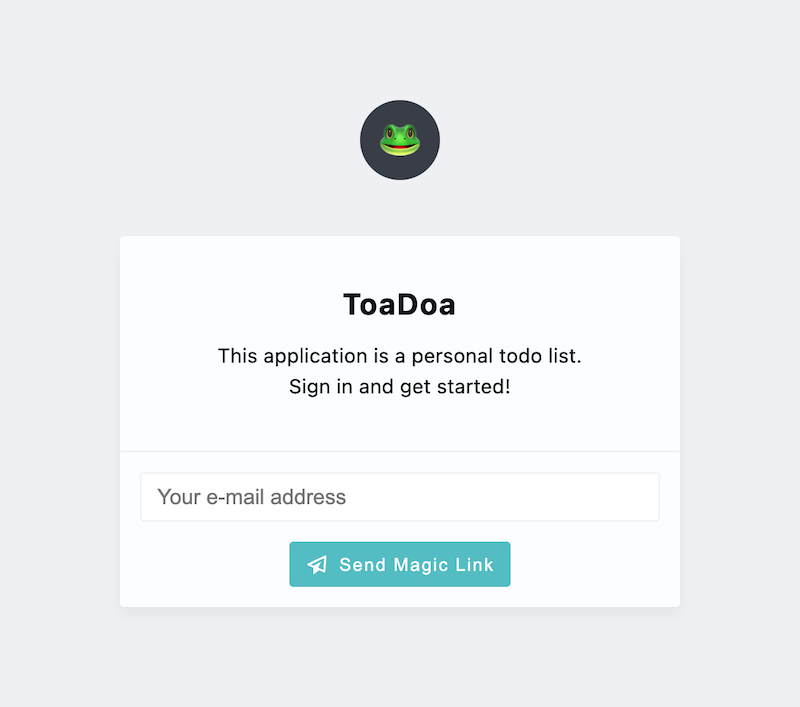
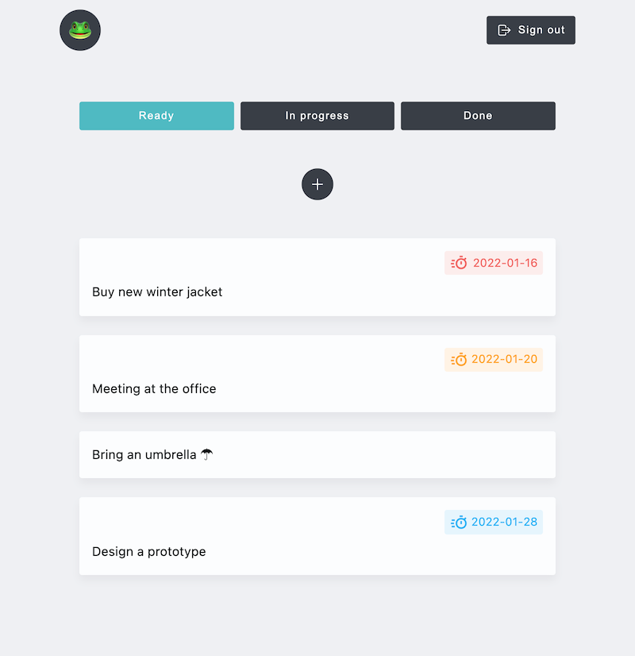

# ToaDoa 🐸

This repo contains **todo list application** built with React.js and [Supabase](https://supabase.com/) (BaaS).


## 👜 Preparation

### Create dotenv file

```bash
cp .env.example .env.development

# Fill in your supabase project configuration
vi .env.development
```

### Initialize DB on Supabase

The following commands will help you set up the database.

```bash
yarn sequelize-cli db:migrate
```

See files under `sequelize/migrations` directory for details.

### Run on localhost

1. `yarn start`
2. http://locahost:3000/
    - If port 3000 is already in use, another port will be allocated.


## 💡 Tips

### Database migrations with Sequelize

This project uses Sequelize to migrate or manage the database (Postgres).

```bash
# Case: Set NODE_ENV variable
## Loading .env.development file
NODE_ENV=development yarn sequelize-cli {some-command}
## Loading .env.production file
NODE_ENV=production yarn sequelize-cli {some-command}

# Case: Not set NODE_ENV variable
## Loading .env.development file (default: development)
yarn sequelize-cli {some-command}
```


## 📸 Screenshots

| Login Form        | Todo List         |
|-------------------|-------------------|
|  |  |
